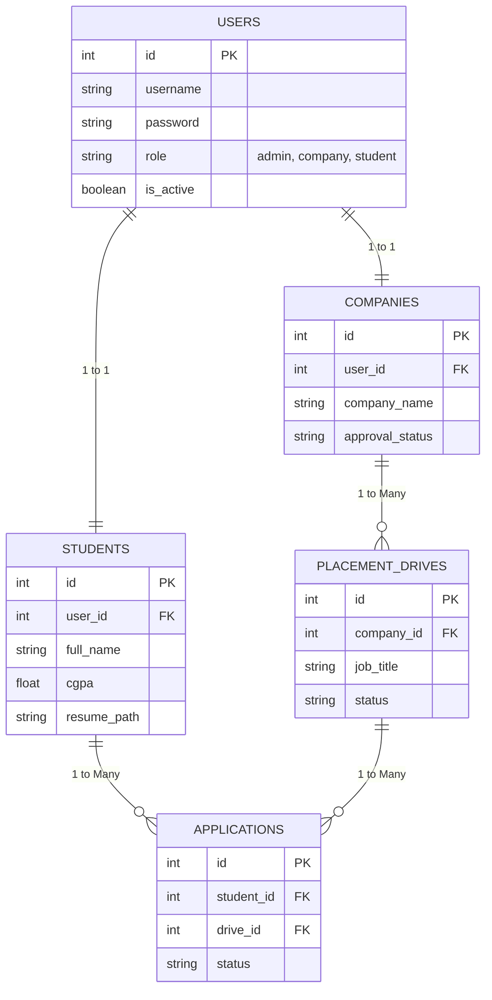

# Placement Portal

A comprehensive Flask-based web application to manage university recruitment, connecting Students, Companies, and Administrators.

## 🚀 Features

### For Administrators (`admin` / `admin123`)
- **Dashboard Overview**: Metrics on total students, companies, drives, and applications.
- **Company Approvals**: Review, approve, reject, or blacklist company registrations.
- **Drive Management**: Approve or reject job postings created by companies.
- **Student Management**: Overview, activate/deactivate, and delete student accounts.

### For Companies
- **Profile Registration**: Register and await admin approval.
- **Drive Postings**: Draft and submit job recruitment drives (title, description, eligibility, deadline, salary, location).
- **Application Management**: View student applications, review resumes, and change status (Applied, Shortlisted, Selected, Rejected).

### For Students
- **Dashboard**: View approved recruitment drives currently accepting applications.
- **Profile & Resume**: Update GPA, contact details, and upload resume.
- **Applications**: Apply to open drives with one click and track the real-time status of past applications.

## 📁 Architecture & Database Design

The application follows a monolithic Blueprint architecture containing `auth`, `admin`, `company`, and `student` modules and utilizes SQLite for relational persistence.



## 🛠 Setup & Installation Guide

1. **Create a Virtual Environment**
   ```bash
   python -m venv venv
   ```

2. **Activate the Virtual Environment**
   - Windows:
     ```bash
     venv\Scripts\activate
     ```
   - Mac/Linux:
     ```bash
     source venv/bin/activate
     ```

3. **Install Dependencies**
   ```bash
   pip install -r requirements.txt
   ```

4. **Run the Application**
   ```bash
   python app.py
   ```
   > [!NOTE]
   > The SQLite database (`placement_portal.db`) is automatically initialized upon running `app.py`. The default admin user is seeded with username **admin** and password **admin123**.

## 🧪 Testing with Mock Data

To quickly populate the portal during a demo or review, a database seeding script (`seed.py`) is provided. This injects the system with mock Students, Companies, Drives, and Applications.

1. Ensure the database exists (or run `app.py` once).
2. Run the seed script:
   ```bash
   python seed.py
   ```
3. Restart `python app.py`.

### Demo Accounts Available (Post-Seed)
- **Admin**: `admin` / `admin123`
- **Student 1**: `student1` / `password123`
- **Student 2**: `student2` / `password123`
- **Company 1**: `techcorp` / `password123`
- **Company 2**: `innovateio` / `password123`
